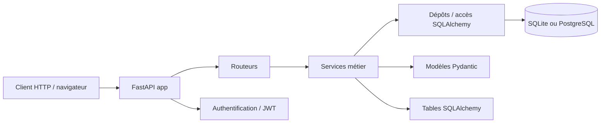

# API Jeux 🎮

API REST pour gérer un catalogue de jeux vidéo avec authentification, autorisations, recherche filtrée et statistiques.

## Prérequis

- Python 3.12
- pip
- Git
- Un terminal compatible Bash ou PowerShell
- Une base SQLite locale par défaut (`jeux.db`) ; le projet peut aussi fonctionner avec PostgreSQL via `DATABASE_URL`

## Démarrage rapide

### Windows (PowerShell)

```powershell
cd C:\chemin\vers\Projet-Tc-dt-S1
python -m venv .venv
.\.venv\Scripts\Activate.ps1
python -m pip install --upgrade pip
python -m pip install -r requirements.txt
Copy-Item .env.example .env
python -m uvicorn app.main:app --reload
```

### Linux / macOS

```bash
cd /chemin/vers/Projet-Tc-dt-S1
python3 -m venv .venv
source .venv/bin/activate
python -m pip install --upgrade pip
python -m pip install -r requirements.txt
cp .env.example .env
python -m uvicorn app.main:app --reload
```

Résultat attendu : l’API démarre sans erreur et la documentation interactive est disponible à l’adresse http://localhost:8000/docs.

## Configuration

Copiez le fichier `.env.example` vers `.env` et personnalisez les valeurs nécessaires.

| Variable | Rôle | Obligatoire | Valeur par défaut |
| --- | --- | --- | --- |
| `DATABASE_URL` | Chaîne de connexion SQLAlchemy à la base. | Oui | `sqlite:///./jeux.db` |
| `CLE_SECRETE` | Clé utilisée pour signer les jetons JWT. | Oui | `une-cle-de-dev` |
| `ALGORITHME_JETON` | Algorithme de signature JWT. | Non | `HS256` |
| `DUREE_JETON_MINUTES` | Durée de validité des jetons d’accès. | Non | `30` |
| `ORIGINES_AUTORISEES` | Origines autorisées par CORS. | Non | `http://localhost:5173` |
| `ENVIRONNEMENT` | Mode d’exécution (`developpement`, `production`, etc.). | Non | `developpement` |
| `NIVEAU_JOURNAL` | Niveau de journalisation. | Non | `INFO` |
| `ECHO_SQL` | Active le log des requêtes SQL. | Non | `false` |
| `MAX_TENTATIVES_CONNEXION` | Nombre maximal de tentatives de connexion avant blocage. | Non | `5` |
| `FENETRE_TENTATIVES_MINUTES` | Durée de la fenêtre de blocage des tentatives. | Non | `15` |

## Utilisation

### Vérifier que l’API répond

```bash
curl http://localhost:8000/
```

Réponse attendue :

```json
{"message": "API opérationnelle"}
```

### Vérifier la santé de l’application

```bash
curl http://localhost:8000/sante
```

### Documentation interactive

Ouvrez :

- http://localhost:8000/docs
- http://localhost:8000/redoc

La documentation OpenAPI générée par FastAPI liste les routes, les schémas de données et les exemples de requêtes.

### Exemple : créer un jeu

```bash
curl -X POST "http://localhost:8000/api/v1/jeux" \
  -H "Content-Type: application/json" \
  -H "Authorization: Bearer <jeton>" \
  -d '{
    "titre": "Celeste",
    "genre": "Plateforme",
    "note": 9,
    "annee": 2018
  }'
```

## Tests

Pour lancer la suite de tests :

```bash
python -m pytest -q
```

Pour lancer le linter :

```bash
python -m ruff check .
```

## Architecture



### Dossiers principaux

- `app/` : application principale
  - `base_donnees.py` : création de la base et session SQLAlchemy
  - `config.py` : variables d’environnement et validation
  - `dependances.py` : dépendances FastAPI
  - `exceptions.py` : exceptions métier
  - `journalisation.py` : configuration des logs
  - `main.py` : assemblage de l’application et gestion des erreurs
  - `modeles/` : schémas Pydantic de validation et sérialisation
  - `routeurs/` : endpoints HTTP
  - `securite.py` : hachage des mots de passe et gestion JWT
  - `services/` : logique de gestion de la business logic
  - `tables/` : modèles SQLAlchemy
  - `depots/` : accès aux données et requêtes SQL
- `tests/` : tests d’intégration et de validation métier
- `donnees/` : jeux et données initiales
- `scripts/` : scripts utilitaires

## Contribuer

1. Ouvrez ou créez une issue décrivant le besoin ou le correctif.
2. Créez une branche dédiée : `fix/...`, `feat/...`, `docs/...`.
3. Travaillez en petits commits lisibles, avec messages conventionnels.
4. Ouvrez une pull request relue par au moins un autre membre de l’équipe.
5. Corrigez les retours de relecture, puis fusionnez la branche après validation.

Le projet suit la règle : une issue, une branche, une PR relue, puis fusion.

## Licence

Projet pédagogique pour le module Travail collaboratif & documentation technique.
