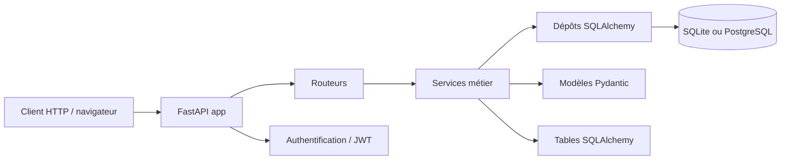

# API Jeux 🎮

API REST de catalogue de jeux vidéo développée avec FastAPI. Elle permet de gérer des jeux, des éditeurs, l’authentification des utilisateurs, les autorisations, les filtres et les statistiques du catalogue.

## À propos du projet

Cette application est un projet pédagogique centré sur trois objectifs :

- exposer une API REST propre et documentée
- séparer les couches métier, données et routes
- appliquer les bonnes pratiques de sécurité, de validation et de documentation

Le projet est prêt à être lancé en local avec SQLite par défaut, et peut aussi être configuré pour PostgreSQL via `DATABASE_URL`.

## Prérequis

Avant de lancer l’application, vérifiez que vous avez :

- Python 3.12
- `pip`
- Git
- un terminal PowerShell (Windows) ou Bash (Linux/macOS)
- un dossier de projet cloné localement

## Démarrage rapide

### Windows (PowerShell)

Depuis le dossier du projet :

```powershell
cd C:\chemin\vers\Projet-Tc-dt-S1
python -m venv .venv
.\.venv\Scripts\python.exe -m pip install --upgrade pip
.\.venv\Scripts\python.exe -m pip install -r requirements.txt
Copy-Item .env.example .env
.\.venv\Scripts\python.exe -m uvicorn app.main:app --host 127.0.0.1 --port 8000 --reload
```

Si PowerShell refuse d’exécuter le script d’activation du venv avec `Activate.ps1`, utilisez directement les exécutables dans `.venv` comme ci-dessus.

Si vous souhaitez malgré activer le venv manuellement, vous pouvez faire :

```powershell
Set-ExecutionPolicy -Scope Process -ExecutionPolicy Bypass
.\.venv\Scripts\Activate.ps1
```

### Linux / macOS

```bash
cd /chemin/vers/Projet-Tc-dt-S1
python3 -m venv .venv
source .venv/bin/activate
python -m pip install --upgrade pip
python -m pip install -r requirements.txt
cp .env.example .env
python -m uvicorn app.main:app --host 127.0.0.1 --port 8000 --reload
```

### Résultat attendu

L’API doit démarrer sans erreur. Vous pouvez ensuite ouvrir :

- http://localhost:8000/docs
- http://localhost:8000/redoc

## Configuration

Copiez le fichier `.env.example` vers `.env` puis adaptez les valeurs selon votre environnement.

```env
DATABASE_URL=sqlite:///./jeux.db
CLE_SECRETE=une-cle-de-dev
DUREE_JETON_MINUTES=30
ORIGINES_AUTORISEES=http://localhost:5173
ENVIRONNEMENT=developpement
NIVEAU_JOURNAL=INFO
ECHO_SQL=false
MAX_TENTATIVES_CONNEXION=5
FENETRE_TENTATIVES_MINUTES=15
```

### Variables disponibles

| Variable | Rôle | Obligatoire | Valeur par défaut |
| --- | --- | --- | --- |
| `DATABASE_URL` | URL de connexion SQLAlchemy à la base de données. | Oui | `sqlite:///./jeux.db` |
| `CLE_SECRETE` | Clé utilisée pour signer les JWT. | Oui | `une-cle-de-dev` |
| `ALGORITHME_JETON` | Algorithme de signature JWT. | Non | `HS256` |
| `DUREE_JETON_MINUTES` | Durée de validité des jetons d’accès. | Non | `30` |
| `ORIGINES_AUTORISEES` | Liste des origines autorisées par CORS. | Non | `http://localhost:5173` |
| `ENVIRONNEMENT` | Nom de l’environnement d’exécution. | Non | `developpement` |
| `NIVEAU_JOURNAL` | Niveau de journalisation. | Non | `INFO` |
| `ECHO_SQL` | Active le log des requêtes SQL. | Non | `false` |
| `MAX_TENTATIVES_CONNEXION` | Nombre maximal de tentatives avant blocage. | Non | `5` |
| `FENETRE_TENTATIVES_MINUTES` | Durée de la fenêtre de blocage. | Non | `15` |

## Utilisation

### 1) Vérifier que l’API répond

```bash
curl http://localhost:8000/
```

Réponse attendue :

```json
{"message": "API opérationnelle"}
```

### 2) Vérifier la santé de l’application

```bash
curl http://localhost:8000/sante
```

Réponse attendue :

```json
{"statut": "ok", "base": "ok", "environnement": "developpement"}
```

### 3) Documentation interactive

Une fois démarrée, ouvrez :

- http://localhost:8000/docs
- http://localhost:8000/redoc

La documentation OpenAPI générée par FastAPI liste les routes, les payloads, les réponses et les validations.

### 4) S’inscrire et se connecter

Inscription :

```bash
curl -X POST "http://localhost:8000/api/v1/inscription" \
  -H "Content-Type: application/json" \
  -d '{
    "email": "user@example.com",
    "mot_de_passe": "motdepasse123"
  }'
```

Connexion :

```bash
curl -X POST "http://localhost:8000/api/v1/connexion" \
  -H "Content-Type: application/x-www-form-urlencoded" \
  -d "username=user@example.com&password=motdepasse123"
```

Le serveur renvoie un `access_token` que vous pouvez ensuite utiliser dans l’header `Authorization`.

### 5) Créer un jeu

```bash
curl -X POST "http://localhost:8000/api/v1/jeux" \
  -H "Content-Type: application/json" \
  -H "Authorization: Bearer <access_token>" \
  -d '{
    "titre": "Celeste",
    "genre": "Plateforme",
    "note": 9,
    "annee": 2018
  }'
```

### 6) Lister les jeux

```bash
curl "http://localhost:8000/api/v1/jeux?genre=Plateforme&note_min=8"
```

## Tests

Lancer toute la suite de tests :

```bash
python -m pytest -q
```

Lancer le linter :

```bash
python -m ruff check .
```

## Architecture



### Arborescence principale

- `app/` : application principale
  - `main.py` : assemblage de l’application, middleware et gestion des erreurs
  - `config.py` : configuration chargée depuis `.env`
  - `base_donnees.py` : base SQLAlchemy et création des tables
  - `dependances.py` : dépendances injectable par FastAPI
  - `exceptions.py` : exceptions métier spécifiques à l’API
  - `journalisation.py` : configuration des logs
  - `modeles/` : schémas Pydantic pour validation et sérialisation
  - `routeurs/` : endpoints HTTP par domaine fonctionnel
  - `services/` : logique métier
  - `depots/` : accès aux données et requêtes SQL
  - `tables/` : modèles ORM SQLAlchemy
  - `securite.py` : hachage des mots de passe et JWT
- `tests/` : tests de validation et d’intégration
- `donnees/` : données de référence et scripts de chargement
- `scripts/` : scripts utiles au projet
- `.env.example` : modèle de configuration

## Contribuer

Le projet suit une méthode simple et claire :

1. créer une issue pour un besoin ou un bug
2. créer une branche dédiée (`fix/...`, `feat/...`, `docs/...`)
3. faire des commits lisibles et ciblés
4. ouvrir une pull request relue par un autre membre de l’équipe
5. corriger les retours de relecture puis fusionner la branche

Le but est de garantir qu’une modification ne soit jamais validée seule, et que le code reste facilement relisible et maintenable.

## Sécurité

- les mots de passe ne sont jamais stockés en clair
- les jetons JWT sont signés avec une clé configurée dans `CLE_SECRETE`
- les accès sensibles sont contrôlés par les rôles et par les permissions métier
- les erreurs serveur ne divulguent pas les détails internes au client

## Licence

Projet pédagogique pour le module Travail collaboratif & documentation technique.
